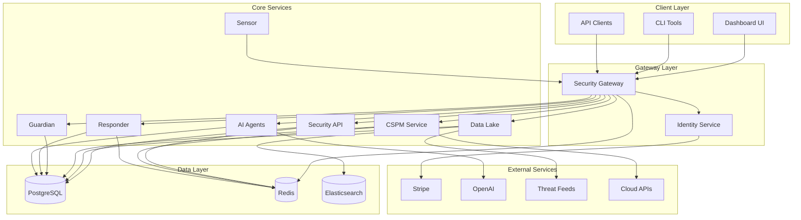

<div align="center">
  <!-- Demo Video -->
  <a href="https://youtu.be/BjuTF6yJ_JA">
    
  </a>
  <br/><br/>

  <!-- Logo -->
  

  <br/><br/>

  <!-- Watch Demo Button -->
  <a href="https://youtu.be/BjuTF6yJ_JA">
    
  </a>
</div>

# Wildbox

Self-hosted, open-source security operations platform. Threat monitoring, analysis, and automated response with full control over your data.

[](https://opensource.org/licenses/MIT)
[](https://docker.com)
[](https://python.org)
[](https://typescriptlang.org)
[](https://github.com/fabriziosalmi/wildbox/actions/workflows/github-code-scanning/codeql)
[](https://github.com/fabriziosalmi/wildbox/actions/workflows/dependabot/dependabot-updates)

## Featured on
[](https://selfh.st/weekly/2025-11-07/)
[](https://www.libhunt.com/r/wildbox)
[](https://www.producthunt.com/posts/wildbox)

---

## What is Wildbox?

- Aggregate threat intelligence from 50+ sources
- Monitor cloud infrastructure security posture (AWS, Azure, GCP)
- Automate incident response with YAML playbooks
- Track and manage vulnerabilities
- Collect endpoint telemetry
- Use LLMs for threat analysis and report generation

## Features

| Feature | Description |
| :--- | :--- |
| **API Gateway** | Single entry point with rate-limiting and authentication |
| **Identity Management** | Users, teams, RBAC (Role-Based Access Control), JWT (JSON Web Tokens) |
| **Cloud Security (CSPM)** | CSPM (Cloud Security Posture Management): scan AWS, Azure, GCP for misconfigurations |
| **Vulnerability Management** | Scan, prioritize, and track vulnerabilities (CVE) |
| **Automated Response (SOAR)** | SOAR (Security Orchestration, Automation, and Response): YAML-based playbooks |
| **LLM Analysis** | LLM-based (Large Language Models) threat analysis and reporting |

## Architecture

Microservices architecture. Each component is an independent service communicating through an API gateway.



## Screenshot


---

## Table of Contents

- [Quick Start](#quick-start)
- [Components](#components)
- [Technology Stack](#technology-stack)
- [Roadmap](#roadmap)
- [Contributing](#contributing)
- [Documentation](#documentation)
- [License](#license)

---

## Quick Start

### Prerequisites
- Docker >= 20.10
- Docker Compose >= 2.0
- 8GB RAM minimum (16GB recommended)
- Linux, macOS, or Windows with WSL2

### Installation

```bash
# 1. Clone the repository
git clone https://github.com/fabriziosalmi/wildbox.git
cd wildbox

# 2. Create environment file from template
cp .env.example .env

# 3. Generate secure secrets
openssl rand -hex 32  # Use output for JWT_SECRET_KEY
openssl rand -hex 32  # Use output for DATABASE_PASSWORD
# Update .env file with generated secrets

# 4. Start all services
docker-compose up -d

# 5. Wait for services to initialize (2-3 minutes)
docker-compose logs -f gateway identity

# 6. Verify health status
curl http://localhost/health
curl http://localhost:8001/health

# 7. Access the platform
# Dashboard: http://localhost:3000
# API Documentation: http://localhost:8000/docs
# Gateway: http://localhost
```

### Default Credentials
- **Email**: `admin@wildbox.security`
- **Password**: `CHANGE-THIS-PASSWORD`

**Change default credentials immediately after first login.**

### Next Steps
1. Review **[Security Best Practices](SECURITY.md)**
2. Configure **[Environment Variables](docs/guides/environment.md)**
3. Read **[Deployment Guide](docs/guides/deployment.md)** for production setup
4. Explore **[API Documentation](docs/api/)**

### Troubleshooting
- Check Docker logs: `docker-compose logs <service-name>`
- Verify port availability: `netstat -tuln | grep -E '(8000|8001|3000|5432|6379)'`
- Ensure sufficient disk space: `df -h`
- See **[TROUBLESHOOTING.md](TROUBLESHOOTING.md)** for common issues

---

## Components

### **open-security-identity**
Identity management, JWT authentication, API key management, subscription billing.
FastAPI, PostgreSQL, Stripe, JWT.

### **open-security-gateway**
API gateway with routing, rate-limiting, and authentication.
OpenResty (Nginx + Lua), Redis, Docker.

### **open-security-tools**
Unified API for 50+ security tools with dynamic discovery and execution.
FastAPI, Redis, Docker.

### **open-security-data**
Threat intelligence aggregation and serving.
FastAPI, PostgreSQL, Elasticsearch, Redis.

### **open-security-cspm** (In Development)
Multi-cloud security posture management and compliance scanning.
Not enabled in the default `docker-compose.yml`.
FastAPI, Celery, Redis, Python cloud SDKs.

### **open-security-guardian**
Vulnerability lifecycle management with risk-based prioritization.
Django, PostgreSQL, Celery, Redis.

### **open-security-sensor** (In Development)
Endpoint monitoring and telemetry collection.
Not enabled in the default `docker-compose.yml`.
osquery, Python, HTTPS.

### **open-security-responder**
Incident response automation with YAML-based playbooks.
FastAPI, Dramatiq, Redis.

### **open-security-automations**
Node-based workflow automation for connecting services and APIs.
n8n, Node.js, Docker.

### **open-security-agents**
LLM-based security analysis and automation.
FastAPI, Celery, LangChain, OpenAI.

### **open-security-dashboard**
Web interface for the platform.
Next.js, TypeScript, Tailwind CSS, TanStack Query.

---

## Technology Stack

### Frontend
- **Next.js 14** - React framework with App Router
- **TypeScript 5.0+** - Type-safe JavaScript
- **Tailwind CSS** - Utility-first CSS framework
- **Shadcn/ui** - React components built on Radix UI
- **TanStack Query** - Data synchronization for React
- **Recharts** - Charting library for React

### Backend
- **FastAPI** - Python async web framework
- **Django 4.2 LTS** - Python web framework
- **OpenResty** - Nginx + LuaJIT
- **PostgreSQL 15** - Relational database
- **Redis 7** - In-memory data store for caching and queues
- **SQLAlchemy** - Python ORM
- **Alembic** - Database migrations
- **Celery** - Distributed task queue

### AI
- **OpenAI API** - LLM integration for threat analysis
- **LangChain** - LLM application framework
- **Pydantic** - Data validation
- **NLTK** - Natural language processing
- **Scikit-learn** - Machine learning

### Infrastructure
- **Docker / Docker Compose** - Containerization and orchestration
- **Nginx** - Reverse proxy
- **Prometheus** - Metrics and monitoring
- **Grafana** - Visualization
- **GitHub Actions** - CI/CD

### Security
- **JWT** - Authentication tokens
- **bcrypt** - Password hashing
- **cryptography** - Cryptographic primitives
- **osquery** - Endpoint monitoring
- **TLS 1.3** - Transport encryption

---

## Roadmap

**Current version: v0.5.5 (Security-Hardened)**

**Phase 1: Stabilization** - Done
- Core security controls, documentation, CI/CD

**Phase 2: Security Hardening** - Done
- 3-round security audit, 35 issues fixed
- 96/98 Dependabot alerts resolved
- JWT revocation, account lockout, network segmentation
- Docker network isolation, CI/CD secrets, Prometheus alerting

**Phase 3: Feature Expansion** - Planned
- Additional cloud provider integrations
- Extended SOAR capabilities
- Next.js 16 migration

---

## Contributing

See **[Contributing Guide](CONTRIBUTING.md)** for development setup and guidelines.

---

## Documentation

Full documentation: **[wildbox.io](https://www.wildbox.io)**

- **[SETUP_GUIDE.md](SETUP_GUIDE.md)** - Deployment guide
- **[SECURITY.md](SECURITY.md)** - Security policy and vulnerability reporting
- **[TROUBLESHOOTING.md](TROUBLESHOOTING.md)** - Common issues and solutions
- **[CHANGELOG.md](CHANGELOG.md)** - Version history

---

## License

MIT License. See [LICENSE](LICENSE).

---

## Support

- **Issues**: [GitHub Issues](https://github.com/fabriziosalmi/wildbox/issues)
- **Discussions**: [GitHub Discussions](https://github.com/fabriziosalmi/wildbox/discussions)
- **Security**: fabrizio.salmi@gmail.com
