<div align="center">
  <!-- Demo Video -->
  <a href="https://youtu.be/BjuTF6yJ_JA">
    
  </a>
  <br/><br/>

  <!-- Logo -->
  

  <br/><br/>

  <!-- Watch Demo Button -->
  <a href="https://youtu.be/BjuTF6yJ_JA">
    
  </a>
</div>

# 🛡️ Wildbox: The Open-Source Security Operations Suite

Wildbox is your all-in-one, self-hosted open-source security platform. It unifies threat monitoring, analysis, and automated response in one place, giving you full control over your data and infrastructure.

[](https://opensource.org/licenses/MIT)
[](https://docker.com)
[](https://python.org)
[](https://typescriptlang.org)
[](https://github.com/fabriziosalmi/wildbox/actions/workflows/github-code-scanning/codeql)
[](https://github.com/fabriziosalmi/wildbox/actions/workflows/dependabot/dependabot-updates)

## Featured on
[](https://selfh.st/weekly/2025-11-07/)
[](https://www.libhunt.com/r/wildbox)
[](https://www.producthunt.com/posts/wildbox)

---

## What is Wildbox?

With Wildbox, you can:
- 🔎 **Centralize** threat intelligence from over 50 sources.
- 🛡️ **Monitor** your cloud infrastructure security (CSPM).
- 🤖 **Automate** incident response with customizable playbooks.
- 🖥️ **Manage** vulnerabilities through a single dashboard.
- 📡 **Monitor** your endpoints for suspicious activity.
- 🧠 **Leverage AI** for threat analysis and report generation.

## ✨ Features at a Glance

| Icon | Feature | Description |
| :---: | :--- | :--- |
| 🚪 | **Intelligent API Gateway** | A single, secure entry point with rate-limiting and centralized authentication. |
| 🔐 | **Identity Management** | Manage users, teams, and access with RBAC (Role-Based Access Control) and JWT (JSON Web Tokens). |
| ☁️ | **Cloud Security (CSPM)** | CSPM (Cloud Security Posture Management): Scan AWS, Azure, and GCP for misconfigurations and compliance. |
| 🛡️ | **Vulnerability Management** | Scan, prioritize, and manage the lifecycle of vulnerabilities (CVE tracking). |
| ⚡ | **Automated Response (SOAR)** | SOAR (Security Orchestration, Automation, and Response): Execute YAML-based playbooks to automate incident response. |
| 🧠 | **AI Analysis** | Leverage LLMs (Large Language Models) to analyze threats and generate reports. |

## 🏗️ Architecture

Wildbox follows a modern microservices architecture. Each component is an independent service that communicates through a unified API gateway.

```mermaid
graph TD
    subgraph "Client Layer"
        UI[Dashboard UI]
        CLI[CLI Tools]
        API_CLIENT[API Clients]
    end
    
    subgraph "Gateway Layer"
        GATEWAY[🚪 Security Gateway]
        IDENTITY[🔐 Identity Service]
    end
    
    subgraph "Core Services"
        API[🔧 Security API]
        DATA[📊 Data Lake]
        CSPM[☁️ CSPM Service]
        GUARDIAN[🛡️ Guardian]
        RESPONDER[⚡ Responder]
        AGENTS[🧠 AI Agents]
        SENSOR[📡 Sensor]
    end
    
    subgraph "Data Layer"
        POSTGRES[(PostgreSQL)]
        REDIS[(Redis)]
        ELASTICSEARCH[(Elasticsearch)]
    end
    
    subgraph "External Services"
        STRIPE[Stripe]
        OPENAI[OpenAI]
        FEEDS[Threat Feeds]
        CLOUD_APIS[Cloud APIs]
    end
    
    UI --> GATEWAY
    CLI --> GATEWAY
    API_CLIENT --> GATEWAY
    
    GATEWAY --> IDENTITY
    GATEWAY --> API
    GATEWAY --> DATA
    GATEWAY --> CSPM
    GATEWAY --> GUARDIAN
    GATEWAY --> RESPONDER
    GATEWAY --> AGENTS
    
    SENSOR --> GATEWAY
    
    API --> POSTGRES
    DATA --> POSTGRES
    CSPM --> POSTGRES
    GUARDIAN --> POSTGRES
    RESPONDER --> POSTGRES
    AGENTS --> POSTGRES
    
    GATEWAY --> REDIS
    API --> REDIS
    CSPM --> REDIS
    RESPONDER --> REDIS
    
    DATA --> ELASTICSEARCH
    
    IDENTITY --> STRIPE
    AGENTS --> OPENAI
    DATA --> FEEDS
    CSPM --> CLOUD_APIS
```



## Screenshot


---

## 📋 Table of Contents

- [⚡ Quick Start](#-quick-start)
- [🎯 Platform Overview](#-platform-overview)
- [🚀 Components](#-components)
- [🛠️ Technology Stack](#️-technology-stack)
- [🌟 Community & Roadmap](#-community--roadmap)
- [🤝 Contributing](#-contributing)
- [📖 Documentation](#-documentation)
- [📄 License](#-license)

---

## ⚡ Quick Start

**Get Wildbox running with Docker Compose!**

### Prerequisites
- Docker >= 20.10
- Docker Compose >= 2.0
- 8GB RAM minimum (16GB recommended)
- Linux, macOS, or Windows with WSL2

### Installation Steps

```bash
# 1. Clone the repository
git clone https://github.com/fabriziosalmi/wildbox.git
cd wildbox

# 2. Create environment file from template
cp .env.example .env

# 3. Generate secure secrets for production
# CRITICAL: Replace default secrets before deploying to production
openssl rand -hex 32  # Use output for JWT_SECRET_KEY
openssl rand -hex 32  # Use output for DATABASE_PASSWORD
# Update .env file with generated secrets

# 4. Start all services
docker-compose up -d

# 5. Wait for services to initialize (2-3 minutes)
# Watch logs to monitor startup progress
docker-compose logs -f gateway identity

# 6. Verify health status
curl http://localhost/health  # Gateway health
curl http://localhost:8001/health  # Identity service health

# 7. Access the platform
# Dashboard: http://localhost:3000
# API Documentation: http://localhost:8000/docs
# Gateway: http://localhost
```

### Default Credentials
- **Email**: `admin@wildbox.security`
- **Password**: `CHANGE-THIS-PASSWORD`

**⚠️ SECURITY WARNING**: Change default credentials immediately after first login!

### Next Steps
1. Review **[Security Best Practices](SECURITY.md)**
2. Configure **[Environment Variables](docs/guides/environment.md)**
3. Read **[Deployment Guide](docs/guides/deployment.md)** for production setup
4. Explore **[API Documentation](docs/api/)** to integrate with your tools

### Troubleshooting
If services fail to start:
- Check Docker logs: `docker-compose logs <service-name>`
- Verify port availability: `netstat -tuln | grep -E '(8000|8001|3000|5432|6379)'`
- Ensure sufficient disk space: `df -h`
- See **[TROUBLESHOOTING.md](TROUBLESHOOTING.md)** for common issues

---

## 🎯 Platform Overview

Wildbox is a **complete security operations platform** built from the ground up with modularity, scalability, and extensibility at its core. Each component operates as an independent microservice while seamlessly integrating to provide a unified security experience.

---

## 🚀 Components

### 🔐 **open-security-identity**
**The Authentication & Authorization Hub**

- **Purpose**: Centralized identity management, JWT authentication, API key management, and subscription billing
- **Technology**: FastAPI, PostgreSQL, Stripe, JWT

### 🚪 **open-security-gateway** 
**The Intelligent API Gateway**

- **Purpose**: Single entry point for all Wildbox services with advanced security and routing
- **Technology**: OpenResty (Nginx + Lua), Redis, Docker

### 🔧 **open-security-tools**
**The Security Toolbox**

- **Purpose**: Unified API for 50+ security tools with dynamic discovery and execution
- **Technology**: FastAPI, Redis, Docker

### 📊 **open-security-data**
**The Intelligence Repository**

- **Purpose**: Centralized threat intelligence aggregation and serving
- **Technology**: FastAPI, PostgreSQL, Elasticsearch, Redis

### ☁️ **open-security-cspm** (In Development)
**The Cloud Security Posture Manager**

- **Purpose**: Multi-cloud security posture management and compliance scanning.
- **Note**: This service is under active development and is not enabled in the default `docker-compose.yml`.
- **Technology**: FastAPI, Celery, Redis, Python cloud SDKs

### 🛡️ **open-security-guardian**
**The Vulnerability Manager**

- **Purpose**: Comprehensive vulnerability lifecycle management with risk-based prioritization
- **Technology**: Django, PostgreSQL, Celery, Redis

### 📡 **open-security-sensor** (In Development)
**The Endpoint Agent**

- **Purpose**: Lightweight endpoint monitoring and telemetry collection.
- **Note**: This service is under active development and is not enabled in the default `docker-compose.yml`.
- **Technology**: osquery, Python, HTTPS

### ⚡ **open-security-responder**
**The Automation Engine**

- **Purpose**: SOAR platform for incident response automation using Python-based logic.
- **Technology**: FastAPI, Dramatiq, Redis, YAML

### 🤖 **open-security-automations**
**The Workflow Automation Hub**

- **Purpose**: Visual, node-based workflow automation for connecting services and APIs.
- **Technology**: n8n, Node.js, Docker

### 🧠 **open-security-agents**
**The AI Brain**

- **Purpose**: AI-powered security analysis and automation
- **Technology**: FastAPI, Celery, LangChain, OpenAI

### 🖥️ **open-security-dashboard**
**The Command Center**

- **Purpose**: Unified web interface for the entire security platform
- **Technology**: Next.js, TypeScript, Tailwind CSS, TanStack Query

---

## 🛠️ Technology Stack

### 🖥️ **Frontend Technologies**
- **Next.js 14**: React framework with App Router and Server Components
- **TypeScript 5.0+**: Type-safe JavaScript with modern features
- **Tailwind CSS**: Utility-first CSS framework for rapid styling
- **Shadcn/ui**: High-quality React components built on Radix UI
- **TanStack Query**: Powerful data synchronization for React
- **Recharts**: Composable charting library for React
- **Lucide React**: Beautiful and customizable icon library

### ⚙️ **Backend Technologies**
- **FastAPI**: Modern, fast web framework for building APIs with Python
- **Django 5.0**: High-level Python web framework for rapid development
- **OpenResty**: High-performance web platform with Nginx and LuaJIT scripting
- **PostgreSQL 15**: Advanced open-source relational database
- **Redis 7**: In-memory data structure store for caching and queues
- **SQLAlchemy**: Python SQL toolkit and Object-Relational Mapping
- **Alembic**: Lightweight database migration tool for SQLAlchemy
- **Celery**: Distributed task queue for background processing

### 🧠 **AI & Machine Learning**
- **OpenAI GPT-4o**: Advanced language model for intelligent analysis
- **LangChain**: Framework for developing LLM-powered applications
- **Pydantic**: Data validation using Python type annotations
- **Jinja2**: Modern and designer-friendly templating language
- **NLTK**: Natural Language Toolkit for text processing
- **Scikit-learn**: Machine learning library for predictive analysis

### 🔧 **DevOps & Infrastructure**
- **Docker**: Containerization platform for consistent deployments
- **Docker Compose**: Multi-container Docker application orchestration
- **Nginx**: High-performance web server and reverse proxy
- **Prometheus**: Monitoring system and time series database
- **Grafana**: Analytics and interactive visualization platform
- **GitHub Actions**: CI/CD platform for automated testing and deployment

### 🛡️ **Security Technologies**
- **JWT (JSON Web Tokens)**: Secure authentication token standard
- **bcrypt**: Password hashing function for secure storage
- **python-jose**: JavaScript Object Signing and Encryption for Python
- **cryptography**: Cryptographic recipes and primitives for Python
- **osquery**: SQL-based host monitoring and endpoint visibility
- **TLS 1.3**: Latest Transport Layer Security protocol

---

## 🚀 Community & Roadmap

**Current Status: Security-Hardened (v0.5.4)**

Wildbox has undergone comprehensive security hardening including vulnerability remediation, dependency updates, and infrastructure security improvements.

### 📋 Roadmap

**Phase 1: Evaluation & Stabilization** ✅
- ✅ Core security controls implemented
- ✅ Comprehensive documentation created
- ✅ Community feedback and issue resolution

**Phase 2: Security Hardening** ✅ (Current)
- ✅ 3-round security audit with 35 issues identified and fixed
- ✅ 96/98 Dependabot vulnerability alerts resolved
- ✅ JWT token revocation, account lockout, network segmentation
- ✅ Infrastructure security: Docker network isolation, CI/CD secrets, Prometheus alerting

**Phase 3: Feature Expansion** (Based on Community Demand)
- 📋 Additional cloud provider integrations
- 📋 Extended SOAR automation capabilities
- 📋 Advanced threat intelligence integration
- 📋 Next.js 16 migration (required for remaining 2 CVEs)

---

## 🤝 Contributing

We welcome contributions from the security community! Please see our **[Contributing Guide](CONTRIBUTING.md)** for details on how to get started, our development process, and what we are looking for.

---

## 📖 Documentation

> 🌐 **Complete documentation available online**: Visit **[Wildbox Documentation Site](https://www.wildbox.io)** for the full documentation with organized guides, security reports, and deployment procedures.

For more details, see the following documents:
- **[SETUP_GUIDE.md](SETUP_GUIDE.md)** - Comprehensive deployment guide
- **[SECURITY.md](SECURITY.md)** - Security policy and vulnerability reporting
- **[TROUBLESHOOTING.md](TROUBLESHOOTING.md)** - Common issues and solutions

---

## 📄 License

Wildbox is licensed under the **MIT License**. See the [LICENSE](LICENSE) file for details.

---

## 📞 Support & Contact

- **Issues**: Report bugs on [GitHub Issues](https://github.com/fabriziosalmi/wildbox/issues).
- **Discussions**: Join the [GitHub Discussions](https://github.com/fabriziosalmi/wildbox/discussions).
- **Security**: Email fabrizio.salmi@gmail.com for security vulnerabilities.
